# [Kalvatar] 데이터베이스 모델링 및 ERD 명세서 (v1.0)

본 문서는 **Kalvatar (AI 일정 자동화 및 위치 기반 실시간 캐릭터 소셜 앱)**의 관계형 데이터베이스(MySQL 8.0) 및 인메모리 캐시(Redis 7.x) 구조를 정의한 명세서입니다.

---

## 1. 데이터 저장소 분리 아키텍처 원칙

```
┌────────────────────────────────────────────────────────┐
│                      Spring Boot                       │
└───────────────┬────────────────────────┬───────────────┘
                │                        │
       [ 영속성 & 정합성 보장 ]        [ 실시간 & 고빈도 I/O ]
                ▼                        ▼
     ┌──────────────────────┐ ┌──────────────────────┐
     │      MySQL 8.0       │ │      Redis 7.x       │
     │                      │ │                      │
     │ - 회원/인증/프로필   │ │ - 실시간 최신 좌표   │
     │ - 친구 관계 & 공개설정│ │   (Redis GEO)        │
     │ - 일정 & AI 행동루틴 │ │ - 접속/온라인 상태   │
     │ - 활동 세션 이력     │ │ - 실시간 리액션 큐   │
     │ - 안심존(Safe Zone)  │ │ - WebSocket 라우팅   │
     └──────────────────────┘ └──────────────────────┘
```

1. **RDB (MySQL)**: 무결성과 트랜잭션이 필수적인 계정, 일정, 루틴, 친구 관계 및 종료된 활동의 최종 이력을 영속화합니다.
2. **Cache & In-Memory (Redis)**: 초/분 단위로 갱신되는 **사용자 최신 좌표, 이동 속도, 온라인 세션 상태**는 RDB에 직접 쓰지 않고 Redis의 GEO 및 Key-Value 구조로 처리하여 데이터베이스 병목을 원천 방지합니다.

---

## 2. 통합 ERD 다이어그램 (MySQL)

```mermaid
erDiagram
    USERS ||--|| USER_PROFILES : has
    USERS ||--|| USER_CHARACTERS : owns
    USERS ||--o{ SAFE_ZONES : configures
    USERS ||--o{ DEVICE_TOKENS : registers
    USERS ||--o{ FRIENDSHIPS : initiates
    USERS ||--o{ FRIENDSHIPS : receives
    USERS ||--o{ SCHEDULES : creates
    USERS ||--o{ ACTIVITY_SESSIONS : records

    SCHEDULES ||--o{ ROUTINE_TASKS : contains
    ACTIVITY_SESSIONS ||--o{ ACTIVITY_REACTIONS : receives

    USERS {
        bigint id PK
        string email
        string oauth_provider "KAKAO, APPLE, GOOGLE"
        string oauth_id
        string status "ACTIVE, INACTIVE, BLOCKED"
        datetime created_at
        datetime updated_at
    }

    USER_PROFILES {
        bigint id PK
        bigint user_id FK
        string nickname
        string status_message
        string default_visibility "PRECISE, APPROXIMATE, ACTIVITY_ONLY, GHOST"
        boolean battery_save_mode
    }

    USER_CHARACTERS {
        bigint id PK
        bigint user_id FK
        string base_avatar_id
        json style_config "skin, hair, clothes, accessory"
        datetime updated_at
    }

    SAFE_ZONES {
        bigint id PK
        bigint user_id FK
        string name "우리 집, 회사, 학교 등"
        decimal latitude
        decimal longitude
        int radius_meter "예: 300"
        string masking_activity "REST, WORK, PRIVATE"
        boolean is_active
    }

    FRIENDSHIPS {
        bigint id PK
        bigint requester_id FK
        bigint receiver_id FK
        string status "PENDING, ACCEPTED, REJECTED, BLOCKED"
        string visibility_override "DEFAULT, PRECISE, APPROXIMATE, ACTIVITY_ONLY, GHOST"
        datetime established_at
    }

    SCHEDULES {
        bigint id PK
        bigint user_id FK
        string title
        string category "WORKOUT, WORK, STUDY, HOSPITAL, APPOINTMENT, REST, ETC"
        string raw_input_text "자연어 원문"
        datetime start_time
        datetime end_time
        string location_name
        decimal destination_lat
        decimal destination_lng
        string repeat_pattern "NONE, DAILY, MON_WED_FRI, WEEKLY, ETC"
        string visibility "ALL_FRIENDS, CLOSE_FRIENDS, PRIVATE"
    }

    ROUTINE_TASKS {
        bigint id PK
        bigint schedule_id FK
        string task_type "PREPARE, DEPART, FOCUS_TIMER, CHECKIN, CUSTOM"
        string instruction "운동복 챙기기, 출발 알림 등"
        datetime scheduled_at
        int sort_order
        string external_app_action "MAPS, MUSIC, IN_APP_TIMER, NONE"
        boolean is_completed
        datetime completed_at
    }

    ACTIVITY_SESSIONS {
        bigint id PK
        bigint user_id FK
        bigint schedule_id FK "nullable"
        string activity_type "WORKOUT, STUDY, WORK, CAFE, MOVING, REST"
        string motion_mode "STATIONARY, WALKING, DRIVING, TRANSIT"
        datetime started_at
        datetime ended_at
        string status "SCHEDULED, MOVING, ACTIVE, COMPLETED"
        decimal last_lat
        decimal last_lng
        string location_name
    }

    ACTIVITY_REACTIONS {
        bigint id PK
        bigint activity_session_id FK
        bigint sender_id FK
        bigint receiver_id FK
        string reaction_type "FIRE, COFFEE, CHEER, HEART"
        datetime created_at
    }

    DEVICE_TOKENS {
        bigint id PK
        bigint user_id FK
        string token
        string os_type "IOS, ANDROID"
        datetime updated_at
    }
```



---

## 3. RDB 테이블 상세 명세 (MySQL 8.0 DDL)

### 3.1 회원 & 프로필 & 프라이버시

#### (1) `users` (회원 기본 계정)
| 컬럼명 | 타입 | 제약 조건 | 설명 |
|---|---|---|---|
| `id` | BIGINT | PK, AUTO_INCREMENT | 사용자 식별자 |
| `email` | VARCHAR(100) | NULL | 사용자 이메일 |
| `oauth_provider` | VARCHAR(20) | NOT NULL | `KAKAO`, `APPLE`, `GOOGLE` |
| `oauth_id` | VARCHAR(100) | NOT NULL, UNIQUE(provider, oauth_id) | 소셜 고유 ID |
| `status` | VARCHAR(20) | NOT NULL, DEFAULT 'ACTIVE' | `ACTIVE`, `INACTIVE`, `SUSPENDED` |
| `created_at` | DATETIME | NOT NULL, DEFAULT CURRENT_TIMESTAMP | 가입 일시 |
| `updated_at` | DATETIME | NOT NULL, ON UPDATE CURRENT_TIMESTAMP | 갱신 일시 |

#### (2) `user_profiles` (프로필 & 공개 기본 정책)
| 컬럼명 | 타입 | 제약 조건 | 설명 |
|---|---|---|---|
| `id` | BIGINT | PK, AUTO_INCREMENT | 식별자 |
| `user_id` | BIGINT | FK -> users.id, UNIQUE | 사용자 식별자 |
| `nickname` | VARCHAR(50) | NOT NULL | 닉네임 |
| `status_message` | VARCHAR(100) | NULL | 한 줄 상태 메시지 |
| `default_visibility` | VARCHAR(20) | NOT NULL, DEFAULT 'APPROXIMATE' | `PRECISE`, `APPROXIMATE`, `ACTIVITY_ONLY`, `GHOST` |
| `battery_save_mode` | BOOLEAN | NOT NULL, DEFAULT FALSE | 절전 모드 (위치 수집 빈도 감소 여부) |

#### (3) `user_characters` (캐릭터 아바타 설정)
| 컬럼명 | 타입 | 제약 조건 | 설명 |
|---|---|---|---|
| `id` | BIGINT | PK, AUTO_INCREMENT | 식별자 |
| `user_id` | BIGINT | FK -> users.id, UNIQUE | 사용자 식별자 |
| `base_avatar_id` | VARCHAR(30) | NOT NULL, DEFAULT 'AVATAR_DEFAULT' | 기본 캐릭터 외형 템플릿 |
| `style_config` | JSON | NOT NULL | 커스텀 정보 (의상, 피부톤, 악세서리 등) |
| `updated_at` | DATETIME | NOT NULL | 갱신 일시 |

#### (4) `safe_zones` (안심존: 민감 장소 마스킹)
| 컬럼명 | 타입 | 제약 조건 | 설명 |
|---|---|---|---|
| `id` | BIGINT | PK, AUTO_INCREMENT | 식별자 |
| `user_id` | BIGINT | FK -> users.id, INDEX | 사용자 식별자 |
| `name` | VARCHAR(50) | NOT NULL | 장소명 (예: 우리 집, 회사) |
| `latitude` | DECIMAL(10, 8) | NOT NULL | 위도 |
| `longitude` | DECIMAL(11, 8) | NOT NULL | 경도 |
| `radius_meter` | INT | NOT NULL, DEFAULT 300 | 안심존 반경 (기본 300m) |
| `masking_activity` | VARCHAR(30) | NOT NULL, DEFAULT 'REST' | 진입 시 대체 표시할 활동 (`REST`, `WORK`) |
| `is_active` | BOOLEAN | NOT NULL, DEFAULT TRUE | 활성화 여부 |

---

### 3.2 친구 관계 (Friendship)

#### (5) `friendships` (친구 관계 및 친구별 차등 공개)
| 컬럼명 | 타입 | 제약 조건 | 설명 |
|---|---|---|---|
| `id` | BIGINT | PK, AUTO_INCREMENT | 식별자 |
| `requester_id` | BIGINT | FK -> users.id, INDEX | 친구 요청 발신자 |
| `receiver_id` | BIGINT | FK -> users.id, INDEX | 친구 요청 수신자 |
| `status` | VARCHAR(20) | NOT NULL, DEFAULT 'PENDING' | `PENDING`, `ACCEPTED`, `REJECTED`, `BLOCKED` |
| `visibility_override`| VARCHAR(20) | NOT NULL, DEFAULT 'DEFAULT' | `DEFAULT`, `PRECISE`, `APPROXIMATE`, `ACTIVITY_ONLY`, `GHOST` |
| `established_at` | DATETIME | NULL | 친구 수락 일시 |
| `created_at` | DATETIME | NOT NULL, DEFAULT CURRENT_TIMESTAMP | 요청 일시 |

> **복합 인덱스 & 유니크 키**:
> `UNIQUE KEY uk_requester_receiver (requester_id, receiver_id)`
> `INDEX idx_receiver_status (receiver_id, status)`

---

### 3.3 일정 & AI 루틴 (Schedule & Routine)

#### (6) `schedules` (일정 기본 정보)
| 컬럼명 | 타입 | 제약 조건 | 설명 |
|---|---|---|---|
| `id` | BIGINT | PK, AUTO_INCREMENT | 식별자 |
| `user_id` | BIGINT | FK -> users.id, INDEX | 등록 사용자 |
| `title` | VARCHAR(100) | NOT NULL | 일정명 (예: 저녁 웨이트 헬스) |
| `category` | VARCHAR(30) | NOT NULL | `WORKOUT`, `WORK`, `STUDY`, `HOSPITAL`, `APPOINTMENT`, `REST`, `ETC` |
| `raw_input_text` | TEXT | NULL | 사용자가 입력한 자연어 원문 |
| `start_time` | DATETIME | NOT NULL | 시작 일시 |
| `end_time` | DATETIME | NOT NULL | 종료 일시 |
| `location_name` | VARCHAR(100) | NULL | 장소명 |
| `destination_lat`| DECIMAL(10, 8) | NULL | 목적지 위도 |
| `destination_lng`| DECIMAL(11, 8) | NULL | 목적지 경도 |
| `repeat_pattern` | VARCHAR(50) | NOT NULL, DEFAULT 'NONE' | `NONE`, `DAILY`, `MON_WED_FRI` 등 |
| `visibility` | VARCHAR(20) | NOT NULL, DEFAULT 'ALL_FRIENDS'| `ALL_FRIENDS`, `CLOSE_FRIENDS`, `PRIVATE` |

#### (7) `routine_tasks` (AI 자동 생성 행동 루틴)
| 컬럼명 | 타입 | 제약 조건 | 설명 |
|---|---|---|---|
| `id` | BIGINT | PK, AUTO_INCREMENT | 식별자 |
| `schedule_id` | BIGINT | FK -> schedules.id, INDEX | 소속 일정 ID |
| `task_type` | VARCHAR(30) | NOT NULL | `PREPARE`, `DEPART`, `FOCUS_TIMER`, `CHECKIN`, `CUSTOM` |
| `instruction` | VARCHAR(255) | NOT NULL | 실행 안내 문구 (예: 운동복 챙기기 알림) |
| `scheduled_at` | DATETIME | NOT NULL, INDEX | 실행/알림 발송 예정 일시 |
| `sort_order` | INT | NOT NULL, DEFAULT 0 | 단계 순서 |
| `external_app_action`| VARCHAR(30) | NOT NULL, DEFAULT 'NONE' | `MAPS`, `MUSIC`, `IN_APP_TIMER`, `NONE` |
| `is_completed` | BOOLEAN | NOT NULL, DEFAULT FALSE | 완료 여부 |
| `completed_at` | DATETIME | NULL | 실제 완료 일시 |

> **인덱스 전략**:
> `INDEX idx_scheduled_completed (scheduled_at, is_completed)` : 주기적 알림 발송 데몬/배치 쿼리 최적화

---

### 3.4 실시간 활동 및 소셜 인터랙션 (Activity & Social)

#### (8) `activity_sessions` (활동 세션 이력)
| 컬럼명 | 타입 | 제약 조건 | 설명 |
|---|---|---|---|
| `id` | BIGINT | PK, AUTO_INCREMENT | 식별자 |
| `user_id` | BIGINT | FK -> users.id, INDEX | 사용자 ID |
| `schedule_id` | BIGINT | NULL, FK -> schedules.id | 연결된 일정 (자발적 활동 시 NULL) |
| `activity_type` | VARCHAR(30) | NOT NULL | `WORKOUT`, `STUDY`, `WORK`, `CAFE`, `MOVING`, `REST` |
| `motion_mode` | VARCHAR(20) | NOT NULL, DEFAULT 'STATIONARY' | `STATIONARY`, `WALKING`, `DRIVING`, `TRANSIT` |
| `started_at` | DATETIME | NOT NULL | 활동 시작 일시 |
| `ended_at` | DATETIME | NULL | 활동 종료 일시 |
| `status` | VARCHAR(20) | NOT NULL | `SCHEDULED`, `MOVING`, `ACTIVE`, `COMPLETED` |
| `last_lat` | DECIMAL(10, 8) | NULL | 최종 완료 장소 위도 |
| `last_lng` | DECIMAL(11, 8) | NULL | 최종 완료 장소 경도 |
| `location_name` | VARCHAR(100) | NULL | 활동 장소명 |

#### (9) `activity_reactions` (활동 응원 리액션)
| 컬럼명 | 타입 | 제약 조건 | 설명 |
|---|---|---|---|
| `id` | BIGINT | PK, AUTO_INCREMENT | 식별자 |
| `activity_session_id` | BIGINT | FK -> activity_sessions.id, INDEX | 반응 대상 세션 ID |
| `sender_id` | BIGINT | FK -> users.id, INDEX | 반응 발신자 ID |
| `receiver_id` | BIGINT | FK -> users.id, INDEX | 반응 수신자 ID |
| `reaction_type` | VARCHAR(20) | NOT NULL | `FIRE`, `COFFEE`, `CHEER`, `HEART` |
| `created_at` | DATETIME | NOT NULL, DEFAULT CURRENT_TIMESTAMP | 전송 일시 |

---

## 4. Redis 데이터 구조 및 캐싱 설계

실시간성 보장과 MySQL I/O 부하 절감을 위해 Redis를 다음과 같이 설계합니다.

### 4.1 실시간 사용자 좌표 (Redis GEO)
- **Key**: `geo:user_locations`
- **Type**: `GEO` (Sorted Set 내부 구현)
- **명령어**:
  ```bash
  # 좌표 업데이트 (경도, 위도, userId)
  GEOADD geo:user_locations 127.0365 37.5008 1001

  # 특정 반경 내 친구 좌표 검색
  GEORADIUSBYMEMBER geo:user_locations 1001 5000 m WITHCOORD
  ```

### 4.2 사용자 실시간 상태 해시 (User State Hash)
- **Key**: `user:state:{userId}`
- **TTL**: `300초 (5분)` (주기적 하트비트 전송 없으면 자동 만료되어 오프라인 처리)
- **Fields**:
  - `online`: `true` / `false`
  - `activity`: `WORKOUT`
  - `motion`: `MOVING` / `STATIONARY`
  - `speed_mps`: `1.2` (초속)
  - `current_zone`: `SAFE_ZONE_HOME` or `NONE`
  - `updated_at`: `2026-10-06T19:05:00`

### 4.3 WebSocket 세션 & 구독자 라우팅
- **Key**: `ws:subscribers:{userId}` (내 위치를 구독 중인 친구 목록)
- **Type**: `SET`
- **용도**: 친구 A가 지도를 켜서 사용자 B를 보고 있을 때만 B의 위치 업데이트를 A에게 WebSocket으로 전송 (불필요한 전체 브로드캐스팅 방지).

### 4.4 안심존 캐시 (Safe Zone In-Memory)
- **Key**: `user:safezones:{userId}`
- **Type**: `JSON / String`
- **용도**: 클라이언트가 좌표를 보고할 때 백엔드가 DB를 매번 조회하지 않고 Redis 캐시에서 사용자의 안심존 목록(반경 및 좌표)을 꺼내 즉시 하버사인(Haversine) 거리 계산 수행.

---

## 5. 성능 및 쿼리 최적화 전략 요약

1. **지오펜싱 & 안심존 연산**:
   - MySQL의 `ST_Distance_Sphere` 함수를 이용한 무거운 공간 쿼리를 지양하고, 백엔드 앱 메모리 및 Redis 레벨에서 경량화된 거리 계산 후 필터링.
2. **알림 스케줄러 인덱싱**:
   - `routine_tasks`의 `(scheduled_at, is_completed)` 복합 인덱스를 통해 매 분 실행되는 스프링 스케줄러가 `O(log N)`으로 전송 대상 태스크만 고속 추출.
3. **친구 목록 상태 동기화**:
   - 친구 목록 조회 시 RDB에서 친구 관계를 가져온 후, 실시간 활동/온라인 상태는 Redis `MGET`으로 파이프라이닝하여 1ms 이내로 결합 응답.
