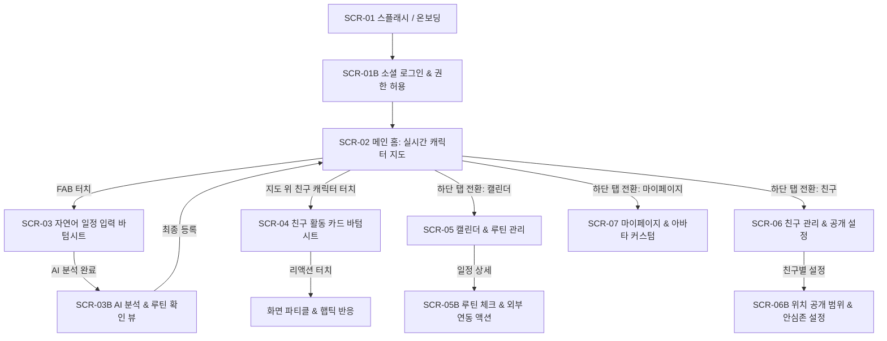

# [Kalvatar] 화면 정의서 (UI/UX Screen Specification v1.0)

본 문서는 **Kalvatar (AI 일정 자동화 및 위치 기반 실시간 캐릭터 소셜 앱)**의 화면 흐름, 레이아웃 와이어프레임, 컴포넌트 인터랙션 및 예외 상태를 정의한 화면 정의서입니다.

---

## 1. 정보 구조도 (Information Architecture) & 화면 흐름 (Flow)



---

## 2. 화면별 상세 정의 (Screen Details)

### 2.1 [SCR-01 / SCR-01B] 온보딩 & 권한 안내, 소셜 로그인

#### (1) 화면 목적
- 서비스의 2대 핵심 가치(AI 일정 루틴 자동화, 지도 위 실시간 아바타 공유) 시각적 전달
- 소셜 간편 로그인 (카카오, 애플, 구글)
- 위치 정보 및 알림 필수/선택 권한 획득

#### (2) 와이어프레임
```text
+---------------------------------------+
|                                       |
|               [ Kalvatar ]            |
|                                       |
|        [ 아바타 애니메이션 일러스트 ]       |
|    "일정을 적으면, 행동이 시작되고     |
|     지도 위 캐릭터가 함께 움직입니다"     |
|                                       |
|    ○  ●  ○  (인디케이터)                 |
|                                       |
|  +---------------------------------+  |
|  |  🟡 카카오로 시작하기           |  |
|  +---------------------------------+  |
|  |    Apple로 시작하기            |  |
|  +---------------------------------+  |
|  |  🌐 Google로 시작하기           |  |
|  +---------------------------------+  |
|                                       |
|   위치 권한 안내: "실시간 공유는 내가      |
|   설정한 시간/친구에게만 활성화됩니다"      |
+---------------------------------------+
```

#### (3) 인터랙션 & 예외 처리
- **권한 유도**: 로그인 직후 OS 시스템 팝업 노출 전, 프리-권한 모달(Pre-permission modal)을 통해 "위치 정보가 어떻게 보호되는지(배터리 최적화, 안심존 보호)"를 먼저 안내하여 승인율 극대화.
- **권한 거부 시**: "위치 공유 없이 캘린더 및 루틴 자동화 전용 모드로 시작" 옵션 제공.

---

### 2.2 [SCR-02] 메인 홈: 실시간 캐릭터 지도 (핵심 화면)

#### (1) 화면 목적
- 지도 위에서 나와 친구들의 **실시간 위치, 이동 상태, 현재 활동**을 직관적으로 확인
- 화면 하단에 **"나의 다음 일정 및 준비 루틴"**을 스냅 바텀시트로 노출하여 실행 유도

#### (2) 와이어프레임
```text
+---------------------------------------+
| [ 프로필/상태 ]        [검색/필터] [🔔] | <- 상단 플로팅 헤더
+---------------------------------------+
|                                       |
|         (지도 영역: Full Screen)       |
|                                       |
|     [ 🚗 민수 (이동 중) ] --->        | <- 실시간 이동 중인 아바타
|                                       |
|                      [ ☕ 지현 ]      | <- 정지 장소 아바타
|                                       |
|     [ 🏠 내 아바타 (휴식 중) ]          |
|                                       |
|                                 [ 🧭 ] | <- 내 위치로 이동 버튼
|                                 [ ➕ ] | <- 자연어 일정 등록 FAB
+---------------------------------------+
|  ▲ 나의 다음 일정 (Bottom Sheet)       |
|  ┌─────────────────────────────────┐  |
|  │ 🏋️ 19:00 헬스장 (웨이트)          │  |
|  │ "40분 후 출발 준비 (도보 15분)"   │  |
|  │ [ 18:20 운동복 챙기기 알림 예약됨 ] │  |
|  └─────────────────────────────────┘  |
+---------------------------------------+
| [🗺️ 지도]  [📅 캘린더]  [👥 친구]  [👤 MY] | <- 하단 네비게이션
+---------------------------------------+
```

#### (3) 주요 컴포넌트 명세
- **상단 헤더 (Floating Bar)**:
  - `내 아바타 썸네일 & 상태 칩`: 터치 시 "지금 내 활동/공개 상태 즉시 변경(예: 비공개 모드 전환)"
  - `필터 칩`: 전체 친구 / 활동 중인 친구만 보기 / 숨기기
  - `알림 센터(🔔)`: 친구의 리액션, 루틴 알림 내역
- **지도 인터랙션 (Map Canvas)**:
  - **아바타 렌더링**: 지도 줌 레벨에 따라 (고배율: 캐릭터 + 활동 애니메이션 + 닉네임, 저배율: 미니 활동 아이콘)
  - **이동 보간**: 좌표가 갱신되면 순간 이동하지 않고 Bezier 곡선 보간을 통해 스무스하게 걷거나 운전하는 모션 재생
  - **안심존 표시**: 집/회사 등으로 지정된 영역은 대략적인 아이콘(`🏠`)과 반경 마스킹 렌더링
- **하단 스냅 바텀시트 (My Routine Snap Sheet)**:
  - 기본 상태(Collapsed): 다음 일정 1개 + 출발 잔여 시간 표시
  - 스와이프 업(Expanded): 오늘 남은 전체 행동 루틴 체크리스트 노출
- **플로팅 등록 버튼 (FAB, ➕)**:
  - 탭 시 `SCR-03 자연어 일정 입력 바텀시트` 즉시 호출

---

### 2.3 [SCR-03 / SCR-03B] 자연어 일정 등록 & AI 루틴 분석 확인

#### (1) 화면 목적
- 자연어(텍스트/음성)로 자유롭게 일정을 입력받아 LLM이 구조화된 데이터 및 루틴을 생성하고, 사용자가 검토 후 등록

#### (2) 와이어프레임
```text
[ SCR-03 입력 바텀시트 ]
+---------------------------------------+
|  새로운 일정 등록                [ X ] |
|                                       |
|  +---------------------------------+  |
|  | "월, 수, 금 저녁 7시에 역삼     |  |
|  |  헬스장에서 1시간 웨이트 운동"   |  |
|  +---------------------------------+  |
|  [ 🎙️ 음성 입력 ]        [ ✨ AI 분석하기 ]|
|                                       |
|  💡 팁: 요일, 시간, 장소, 활동을 편하게  |
|     말하듯 적어보세요!                |
+---------------------------------------+

        ▼ (AI 분석 후 화면 전환: SCR-03B)

[ SCR-03B 분석 결과 및 루틴 확인 ]
+---------------------------------------+
|  일정 및 행동 루틴 생성 완료       [ X ]|
|                                       |
|  📌 일정 정보 [수정]                   |
|  - 분류: 🏋️ 운동                       |
|  - 일시: 매주 (월, 수, 금) 19:00~20:00  |
|  - 장소: 역삼 피트니스 (서울 강남구...) |
|                                       |
|  ⚡ 생성된 실행 루틴 (수정 가능)        |
|  ┌─────────────────────────────────┐  |
|  │ [v] 18:20 🎒 운동복 챙기기 알림   │  |
|  │ [v] 18:40 🚶 출발 알림 (도보 18분) │  |
|  │ [v] 19:00 ⏱️ 60분 운동 타이머     │  |
|  │ [v] 20:00 ✅ 완료 기록 & 상태 공유 │  |
|  └─────────────────────────────────┘  |
|                                       |
|  친구 공유: [ 전원 공개 ▾ ]            |
|                                       |
|  +---------------------------------+  |
|  |        [ 이대로 등록하기 ]       |  |
|  +---------------------------------+  |
+---------------------------------------+
```

#### (3) 인터랙션 명세
- **로딩 피드백**: `AI 분석하기` 터치 시 스켈레톤 UI 또는 아바타가 생각하는 로딩 애니메이션 노출 (평균 응답 1~2초).
- **루틴 커스텀**: 각 루틴 아이템의 토글 스위치(on/off), 알림 시간 탭하여 시간 분 단위 조정 가능.
- **예외 처리**: 장소가 불명확한 경우(예: "그냥 헬스장"), 추천 장소 검색 칩 자동 노출.

---

### 2.4 [SCR-04] 친구 활동 상세 카드 & 리액션 바텀시트

#### (1) 화면 목적
- 지도에서 특정 친구 아바타 터치 시, 친구의 현재 활동 상세 정보를 확인하고 퀵 리액션(응원) 전송

#### (2) 와이어프레임
```text
+---------------------------------------+
|                                       |
|           (상단 반투명 딤 처리)         |
|                                       |
+---------------------------------------+
|  ▲ 친구 활동 정보                [ X ] |
|                                       |
|      ┌─────────────────────────┐      |
|      │    [ 🏋️ 헬스장 배경 ]   │      |
|      │   캐릭터 벤치프레스 모션 │      |
|      └─────────────────────────┘      |
|                                       |
|  민수  ● 온라인                        |
|  🏋️ 웨이트 트레이닝 중 (32분째 진행 중)  |
|  📍 역삼 피트니스 (정확한 위치 공유 중)   |
|                                       |
|  ───────────────────────────────────  |
|  응원 보내기 (탭하면 캐릭터에 팝업)     |
|                                       |
|   [ 🔥 득근! ]  [ 💪 힘내 ]  [ 👏 멋져 ]  |
|   [ ☕ 커피 ]   [ 💬 한마디 보내기 ]   |
+---------------------------------------+
```

#### (3) 인터랙션 & 애니메이션
- **리액션 파티클**: 리액션 버튼(🔥) 탭 시 햅틱(Haptic Feedback)과 함께 지도 위 친구 아바타 머리 위로 불꽃 아이콘이 퐁퐁 솟아오르는 인터랙션 발생.
- **수신자 화면 반응**: 친구가 앱을 보고 있을 경우 WebSocket을 통해 실시간으로 아바타 위에 리액션 뱃지 노출.
- **개인정보 분기**:
  - `대략적 위치`: "📍 역삼동 부근" 표기
  - `활동만 공개`: 장소 영역 숨김 처리 ("📍 장소 비공개")

---

### 2.5 [SCR-05 / SCR-05B] 캘린더 & 행동 루틴 관리 화면

#### (1) 화면 목적
- 전체 일정 목록을 주간/월간 뷰로 확인하고, 각 일정에 연결된 루틴과 외부 앱 바로가기(딥링크) 제공

#### (2) 와이어프레임
```text
+---------------------------------------+
|  2026년 10월                    [ ➕ ] |
|  [<]  10/5(월)  10/6(화)  10/7(수)  [>]|
+---------------------------------------+
|  오늘의 일정 & 루틴 타임라인           |
|                                       |
|  14:00 ~ 15:30 [💻 팀 스프린트 회의]   |
|    └─ [완료됨] 회의 자료 준비         |
|                                       |
|  19:00 ~ 20:00 [🏋️ 저녁 헬스]        |
|    ├─ 18:20 🎒 운동복 챙기기          |
|    ├─ 18:40 🚶 출발 [🗺️ 길찾기]      | <- 지도 앱 딥링크
|    ├─ 19:00 ⏱️ 타이머 [🎵 음악 켜기] │ <- 앱 연동 버튼
|    └─ 20:00 ✅ 운동 완료 체크인      |
|                                       |
|  21:30 ~ 22:30 [📚 스터디 공부]        |
|    └─ 21:30 뽀모도로 타이머 시작      |
+---------------------------------------+
| [🗺️ 지도]  [📅 캘린더]  [👥 친구]  [👤 MY] |
+---------------------------------------+
```

#### (3) 주요 기능
- **원터치 외부 연동 액션**:
  - `[🗺️ 길찾기]`: 카카오맵/네이버지도/Apple Maps URL Scheme 호출
  - `[🎵 음악 켜기]`: Spotify / Apple Music 플레이리스트 실행
  - `[⏱️ 타이머]`: 앱 내 인앱 집중/운동 타이머 풀스크린 전환

---

### 2.6 [SCR-06 / SCR-06B] 친구 관리 & 위치 공개 범위/안심존 설정

#### (1) 화면 목적
- 친구 목록 조회, 친구 요청 관리, 친구별 차등 위치 공개 수준 설정 및 민감 장소(안심존) 관리

#### (2) 와이어프레임
```text
[ SCR-06 친구 목록 ]
+---------------------------------------+
|  친구 (18)              [🔍]  [+ 추가]|
+---------------------------------------+
|  [요청 대기 중 (2)]                   >|
|                                       |
|  민수 (운동 중 🏋️)      [정확한 위치 ▾]|
|  지현 (카페 ☕)          [대략적 위치 ▾]|
|  준호 (오프라인)         [활동만 공개 ▾]|
|  수진                   [비공개 ▾]    |
+---------------------------------------+

        ▼ (개인정보 및 안심존 설정 탭: SCR-06B)

[ SCR-06B 안심존 & 프라이버시 설정 ]
+---------------------------------------+
|  🛡️ 안심존 (Safe Zone) 설정           |
|  지정된 장소에서는 좌표를 숨기고       |
|  대체 상태로 자동 전환됩니다.          |
|                                       |
|  [+] 새 안심존 등록 (집, 회사 등)      |
|                                       |
|  🏠 우리 집 (반경 300m)                |
|     진입 시: "집에서 휴식 중" 마스킹  |
|                                       |
|  🏢 회사 (반경 200m)                  |
|     진입 시: "업무 중" 마스킹         |
|                                       |
|  ⚡ 실시간 공유 기본 정책              |
|  ( ) 항상 공유 (권장하지 않음)         |
|  (●) 일정/루틴 진행 시에만 공유 (권장)  |
|  ( ) 수동 켤 때만 공유                |
+---------------------------------------+
```

#### (3) 보안 및 권한 정책
- 친구별로 4단계 공개 수준(`정밀`, `대략(반경 1km)`, `활동명만`, `비공개`)을 즉시 드롭다운으로 변경 가능.
- 안심존 반경에 진입한 순간, 백엔드 위치 브로드캐스팅 파이프라인에서 실제 GPS 좌표를 제거하고 가상 심볼 좌표 또는 텍스트 상태로 강제 치환.

---

### 2.7 [SCR-07] 마이페이지 & 아바타 커스텀

#### (1) 화면 목적
- 내 프로필 관리, 아바타 외형(얼굴/헤어/기본의상) 선택, 앱 설정(알림, 절전 모드, 계정 탈퇴)

#### (2) 와이어프레임
```text
+---------------------------------------+
|  내 프로필                      [ ⚙️ ] |
+---------------------------------------+
|                                       |
|             [ 내 아바타 ]             |
|          "오늘도 활기찬 하루!"         |
|                                       |
|    [ 🎨 아바타 커스텀 (외형 변경) ]    |
|                                       |
|  📊 나의 루틴 달성 현황                |
|  - 이번 주 목표 달성률: 85%            |
|  - 가장 많이 한 활동: 🏋️ 운동 (12시간)  |
|                                       |
|  ⚙️ 앱 설정                           |
|  - 배터리 절전 모드 (위치 수집 빈도 감소)|
|  - 알림 설정 (소리/진동/시간대)        |
|  - 연결된 계정 관리                    |
+---------------------------------------+
| [🗺️ 지도]  [📅 캘린더]  [👥 친구]  [👤 MY] |
+---------------------------------------+
```

---

## 3. 공통 UI/UX 규칙 및 예외 상태 처리

| 상황 (Context) | 클라이언트 UI 대응 | 사용자 피드백 |
|---|---|---|
| **GPS 수신 불량 (지하/터널)** | 마지막 유효 좌표에 반투명 처리 + 네트워크 핀 표기 | 툴팁: "위치 신호를 찾는 중입니다" |
| **위치 권한 거부** | 지도 상단에 알림 배너 고정 노출 | `[권한 설정 바로가기]` 버튼 및 대체 캘린더 뷰 안내 |
| **오프라인/네트워크 단절** | 로컬 캐시된 마지막 친구 상태 유지 + 상단 토스트 경고 | "네트워크 연결이 끊겼습니다. 오프라인 모드 동작 중" |
| **배터리 부족 (< 15%)** | 위치 전송 주기 자동 감소 (절전 모드 전환) | 하단 스낵바: "배터리 절약을 위해 위치 갱신 주기를 늦춥니다" |
| **AI 파싱 실패 / 모호한 입력** | 에러 알림 대신 대화형 수정 제안 카드 노출 | "시간이나 장소를 조금만 더 알려주시면 루틴을 완성할 수 있어요!" |
