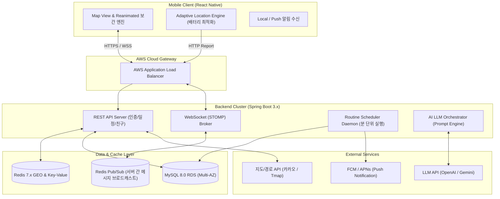
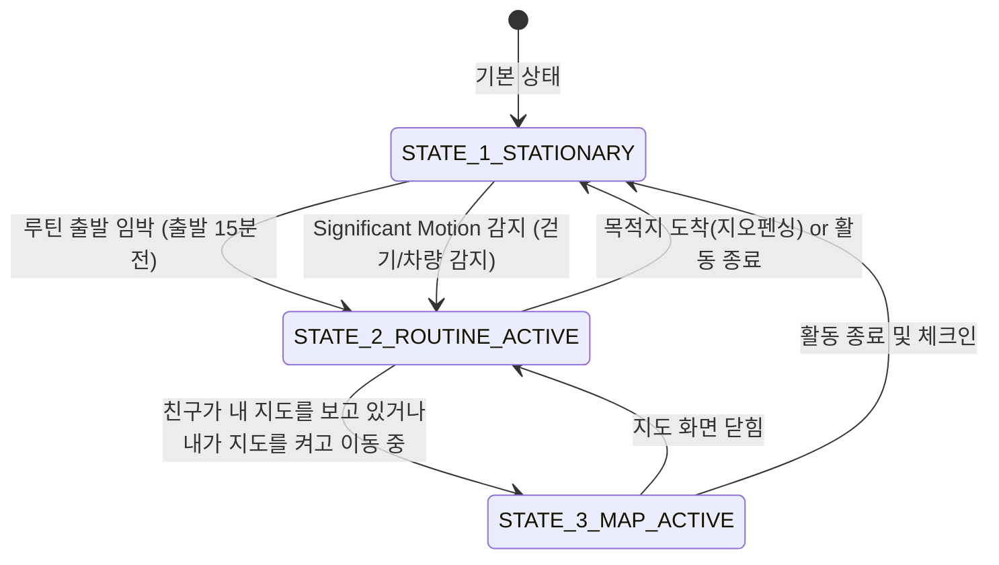
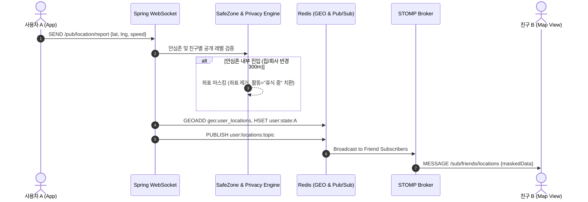

# [Kalvatar] 시스템 아키텍처 및 위치 수집 엔진 설계서 (v1.0)

본 문서는 **Kalvatar (AI 일정 자동화 및 위치 기반 실시간 캐릭터 소셜 앱)**의 **전체 시스템 인프라 구성, 모바일 위치 수집 엔진(배터리 최적화), 실시간 브로드캐스팅 파이프라인, AI 파싱 엔진**을 정의한 기술 설계서입니다.

---

## 1. 전체 시스템 아키텍처 (Infrastructure & Pipeline)



---

## 2. 모바일 위치 수집 엔진 & 배터리 최적화 (Adaptive Location Engine)

### 2.1 문제 정의: 왜 24시간 항시 GPS를 켜면 안 되는가?
- **배터리 광탈**: GPS 칩셋이 풀파워로 동작하면 시간당 10~15% 이상의 배터리가 소모되어 즉각적인 앱 삭제를 유발합니다.
- **OS 백그라운드 킬**: iOS와 Android는 명확한 사유 없이 백그라운드 위치를 지속 요구하는 앱을 강제 종료하거나 앱 스토어 심사에서 리젝트합니다.
- **해결책**: **"루틴 세션"**과 **"움직임 감지(Significant Motion)"**를 결합한 **3단계 적응형 수집(Adaptive Polling)** 전략을 채택합니다.

---

### 2.2 3단계 적응형 수집 라이프사이클 (Adaptive Polling Lifecycle)



| 상태 (Mode) | 동작 조건 | 센서 / 수집 방식 | 수집 및 전송 주기 | 배터리 소모 |
|---|---|---|---|---|
| **State 1: 정지 / 대기 (Stationary)** | 평상시, 안심존(집/회사) 내부, 일정 없음 | GPS OFF. 가속도/보행 카운터 및 기지국 단위 Significant Motion만 대기 | 10~15분 간격 하트비트 또는 움직임 감지 시에만 Wakeup | **극저전력 (< 1%/일)** |
| **State 2: 루틴 이동 중 (Moving Session)** | 루틴 출발 알림 후, 활동 목적지로 이동 중 | Fused Location (GPS + Wi-Fi) 활성화, 유의미한 이동(거리 25m 이상 변화) | 15~30초 단위 | **중저전력 (약 2~3%/시간)** |
| **State 3: 지도 화면 활성 (Active Map View)** | 친구가 내 지도를 보고 있거나, 본인이 지도 화면 실행 중 | 정밀 GPS, 속도/방위각 포함 수집 | 5~10초 단위 (실시간 스트리밍) | 실시간 모드 |

---

### 2.3 OS별 백그라운드 구동 구현 전략
1. **iOS**:
   - `Significant-Change Location Service`를 활용하여 정지 상태 유지.
   - 이동 세션 진입 시 `CLActivityTypeAutomotiveNavigation` 또는 `CLActivityTypeFitness`로 전환.
   - 백그라운드 위치 사용 중임을 사용자가 인지할 수 있도록 상단 파란색 위치 바(Blue Bar) 표출 정책 준수.
2. **Android**:
   - `ActivityRecognitionClient`를 활용해 정지(STILL), 걷기(WALKING), 차량(IN_VEHICLE) 전이 감지.
   - 루틴 진행 중에는 `Foreground Service` + 고정 알림("Kalvatar: 운동 장소로 이동 중입니다")을 띄워 OS의 배터리 최적화 도즈 모드(Doze Mode)에 의한 프로세스 킬 방지.

---

## 3. 클라이언트 좌표 보간 & 캐릭터 애니메이션 엔진

### 3.1 GPS 노이즈(Jitter) 보정: Kalman Filter
- 건물 숲이나 실내 진입 시 발생하는 좌표 튀는 현상을 방지하기 위해 단말 내에서 **경량 1차 칼만 필터(1D/2D Kalman Filter)**를 통과시켜 측정 오차 반경이 큰 좌표는 스무딩 처리.

### 3.2 부드러운 이동 애니메이션 (Reanimated Coordinates Interpolator)
- 이전 좌표 $(Lat_1, Lng_1)$와 새로 수신된 좌표 $(Lat_2, Lng_2)$ 사이를 순간 이동시키지 않고 **React Native Reanimated 3**의 `withTiming`을 사용하여 렌더링:

```typescript
// 클라이언트 좌표 보간 의사코드
const targetLatitude = useSharedValue(initialLat);
const targetLongitude = useSharedValue(initialLng);

const onLocationReceived = (newLat: number, newLng: number, intervalMs: number) => {
  // 이전 수신 주기(예: 15초) 동안 일정 속도로 스무스하게 이동
  targetLatitude.value = withTiming(newLat, {
    duration: intervalMs,
    easing: Easing.bezier(0.25, 0.1, 0.25, 1),
  });
  targetLongitude.value = withTiming(newLng, {
    duration: intervalMs,
    easing: Easing.bezier(0.25, 0.1, 0.25, 1),
  });
};
```

### 3.3 이동 수단(Motion Mode) 판별 로직
- 속도 $V$가 25 km/h 이상 지속 $\rightarrow$ `🚗 차량 이동` 캐릭터로 전환
- 속도 $V$가 4~15 km/h $\rightarrow$ `🚶 걷기 / 🏃 러닝` 캐릭터로 전환
- 속도 $V$ < 3 km/h 5분 이상 지속 $\rightarrow$ `🧍 정지 상태`로 전환

---

## 4. 백엔드 실시간 통신 및 안심존 필터링 파이프라인

### 4.1 메시지 처리 파이프라인 다이어그램



### 4.2 하버사인(Haversine) 안심존 고속 연산
- 사용자가 좌표를 전송할 때마다 DB를 조회하지 않고, 사용자 로그인 시 Redis에 캐싱된 안심존 좌표 목록(`user:safezones:{id}`)을 인메모리에서 읽어 하버사인 공식으로 거리 $D$를 계산:
  $$D = 2R \cdot \arcsin\left(\sqrt{\sin^2\left(\frac{\Delta lat}{2}\right) + \cos(lat_1)\cos(lat_2)\sin^2\left(\frac{\Delta lng}{2}\right)}\right)$$
- $D \le \text{radiusMeter}$ 일 경우 실제 좌표를 숨기고 마스킹 플래그(`isApproximate: true`)를 활성화하여 브로드캐스트.

---

## 5. AI 자연어 일정 파싱 파이프라인 (LLM Orchestrator)

### 5.1 Structured Output 프롬프트 아키텍처
- OpenAI의 **Structured Outputs (json_schema)** 또는 Gemini의 `response_schema`를 강제하여 파싱 실패율 0% 유지.

#### System Prompt
```text
You are Kalvatar's AI Schedule & Action Routine Specialist.
Analyze the user's natural language input and extract structured schedule information.
Then, generate 3-5 sequential actionable routine tasks (prepare, depart, in-action timer, wrap-up/checkin) based on the schedule category, location transit time, and user habits.
Current Local Time: {current_time}
User Current Coordinates: {user_lat, user_lng}
Respond strictly in JSON matching the specified schema.
```

### 5.2 장애 및 지연 대응 (Fallback Strategy)
1. **API 타임아웃 (3초 초과 시)**:
   - 규칙 기반(Regex & Datetime Parser) 간이 파서로 1차 시간/날짜만 추출하여 기본 템플릿 루틴("출발 알림 - 활동 타이머 - 완료") 반환.
2. **장소 모호성 ("그냥 헬스장")**:
   - `locationName: null`, `requiresClarification: true` 플래그를 내려주어 클라이언트가 장소 검색 모달을 띄우도록 유도.
