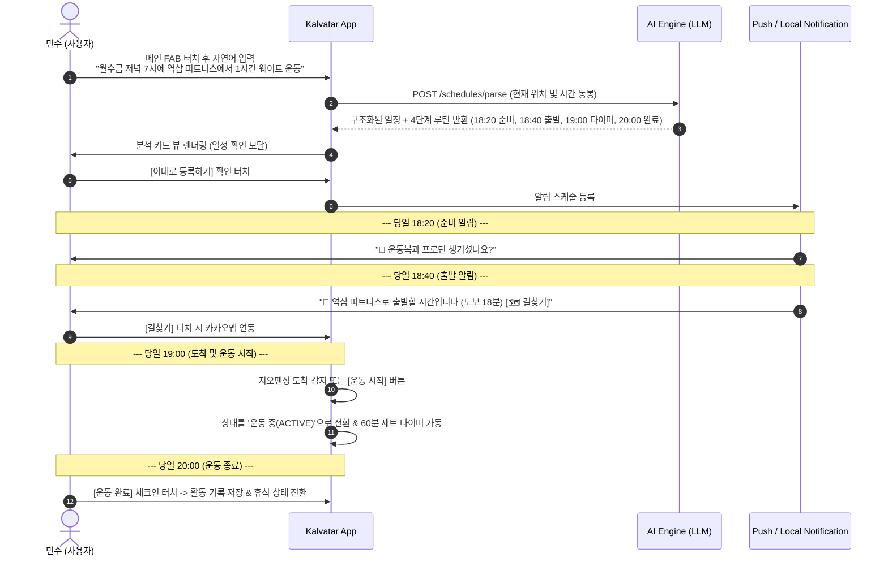
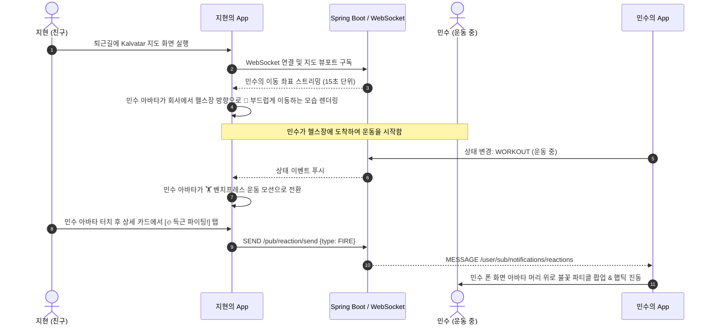
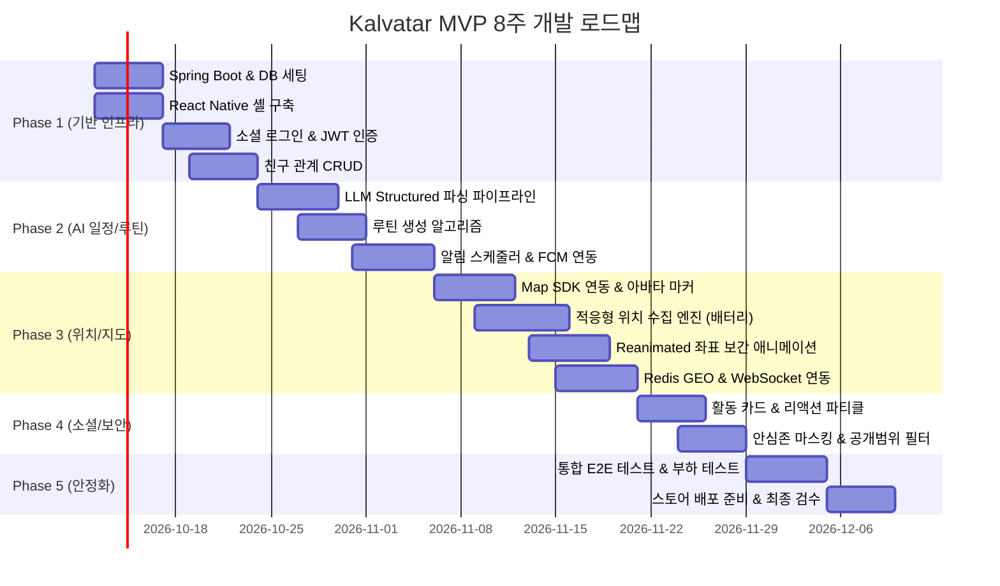

# [Kalvatar] 사용자 핵심 시나리오 및 개발 일정(WBS) (v1.0)

본 문서는 **Kalvatar (AI 일정 자동화 및 위치 기반 실시간 캐릭터 소셜 앱)**의 **E2E 사용자 핵심 시나리오 3선**과 **Phase 1 ~ Phase 5 마일스톤별 WBS(Work Breakdown Structure)**를 정의한 실행 계획서입니다.

---

## 1. E2E 사용자 핵심 시나리오 (User Journeys)

### 시나리오 1: 자연어 일정 입력 → AI 루틴 자동 생성 → 실행 및 완료 체크인
- **페르소나**: 일정이 잦고 자기관리를 하려는 직장인 '민수'
- **목표**: 캘린더를 꼼꼼히 관리하지 않아도 알림과 루틴으로 행동을 놓치지 않기

---

### 시나리오 2: 실시간 캐릭터 이동 관전 → 활동 전환 → 소셜 응원(리액션)
- **페르소나**: 민수의 친구 '지현'
- **목표**: 친구가 지금 무엇을 하고 있는지 지도로 보고 부담 없이 가볍게 응원하기

---

### 시나리오 3: 개인정보 보호와 안심존(Safe Zone) 자동 마스킹
- **페르소나**: 프라이버시에 민감한 사용자 '준호'
- **목표**: 집이나 사적인 장소의 실제 좌표가 친구들에게 노출되지 않도록 완벽 차단

1. **사전 설정**: 준호가 마이페이지에서 "우리 집"을 안심존(반경 300m, 대체 활동: "휴식 중")으로 등록.
2. **이동 중**: 퇴근길에는 이동 모드(`🚶 도보 이동 중`)로 친구들 지도에 좌표가 정상 표시됨.
3. **안심존 진입 감지**:
   - 백엔드 위치 파이프라인에서 하버사인 계산 결과 집 반경 300m 이내로 진입함이 확인됨.
   - 백엔드가 즉시 실제 위도/경도를 숨기고 가상 좌표 또는 장소 비공개 플래그로 치환.
4. **친구 화면 반영**:
   - 친구들의 지도에서 준호의 상세 핀이 사라지고, 대략적인 동 단위 영역에 `🏠 준호: 집에서 휴식 중` 텍스트만 표시되어 사생활이 완벽히 보호됨.

---

## 2. 세부 개발 일정 및 WBS (8주 스프린트 계획)

---

## 3. 마일스톤별 상세 태스크 목록 (Task Breakdown)

### Phase 1: 기반 아키텍처 및 회원/친구 도메인 (Week 1 ~ Week 2)
| ID | 담당 | 작업 내용 (Task) | 완료 기준 (Definition of Done) |
|---|---|---|---|
| BE-101 | 백엔드 | Spring Boot 3.x, MySQL 8.0, Redis 7.x Docker Compose 환경 구축 | 로컬/개발 인프라 정상 구동 |
| BE-102 | 백엔드 | 소셜 로그인(Kakao/Apple) 및 JWT Access/Refresh 토큰 발급 | 로그인 API 및 토큰 갱신 테스트 통과 |
| BE-103 | 백엔드 | 친구 요청, 수락, 차단, 친구 목록 조회 API 구현 | 단위/통합 테스트 완료 |
| FE-101 | 프론트 | React Native (Expo) 프로젝트 세팅 및 React Navigation 구조화 | 온보딩/지도/캘린더/친구 탭 네비게이션 작동 |
| FE-102 | 프론트 | 소셜 로그인 SDK 연동 및 토큰 로컬 스토리지 저장 | 로그인 성공 후 홈 화면 전환 |

---

### Phase 2: AI 자연어 일정 파싱 & 루틴 자동화 (Week 3 ~ Week 4)
| ID | 담당 | 작업 내용 (Task) | 완료 기준 (Definition of Done) |
|---|---|---|---|
| AI-201 | AI/BE | OpenAI/Gemini Structured Outputs 프롬프트 엔지니어링 | 95% 이상 정확도로 일정/장소/루틴 JSON 추출 |
| BE-201 | 백엔드 | 자연어 일정 파싱 API (`/schedules/parse`) 및 일정 저장 API | 요청 후 2초 이내 루틴 생성 응답 |
| BE-202 | 백엔드 | Spring Batch / Scheduled 기반 분 단위 루틴 알림 발송 데몬 | 정해진 시각에 FCM/APNs 푸시 발송 |
| FE-201 | 프론트 | SCR-03 자연어 일정 입력 바텀시트 & AI 분석 확인 카드 UI | 음성/텍스트 입력 후 분석 결과 카드 렌더링 |
| FE-202 | 프론트 | 로컬 푸시 알림 수신 핸들러 및 원터치 딥링크(지도, 음악) 연결 | 알림 터치 시 앱 내 해당 루틴으로 이동 |

---

### Phase 3: 실시간 위치 엔진 & 지도 캐릭터 렌더링 (Week 5 ~ Week 6)
| ID | 담당 | 작업 내용 (Task) | 완료 기준 (Definition of Done) |
|---|---|---|---|
| FE-301 | 프론트 | React Native Maps 지도 뷰 연동 및 커스텀 캐릭터 마커 표시 | 지도 위에 캐릭터 아바타 렌더링 성공 |
| FE-302 | 프론트 | 3단계 적응형 위치 수집(Adaptive Polling) 엔진 구현 | 정지 시 초저전력 대기, 루틴 출발 시 15초 단위 수집 |
| FE-303 | 프론트 | Reanimated 3 좌표 보간 애니메이션 및 칼만 필터 적용 | 좌표 수신 시 캐릭터가 부드럽게 걸어가는 모션 구현 |
| BE-301 | 백엔드 | Redis GEO 기반 사용자 최신 위치 캐싱 및 거리 쿼리 구현 | GEOADD / GEORADIUS 1ms 이내 처리 |
| BE-302 | 백엔드 | Spring WebSocket (STOMP) + Redis Pub/Sub 메시지 브로커 구축 | 다중 인스턴스 환경에서 실시간 위치 브로드캐스트 |

---

### Phase 4: 소셜 인터랙션 & 프라이버시 안심존 (Week 7)
| ID | 담당 | 작업 내용 (Task) | 완료 기준 (Definition of Done) |
|---|---|---|---|
| BE-401 | 백엔드 | 안심존(Safe Zone) 하버사인 연산 및 실시간 좌표 마스킹 필터 | 안심존 진입 시 좌표 숨김 및 대체 활동 치환 |
| BE-402 | 백엔드 | 친구별 4단계 공개수준(정밀/대략/활동만/비공개) 권한 인터셉터 | 친구 권한에 맞춘 차등 데이터 전송 |
| FE-401 | 프론트 | 친구 활동 상세 바텀시트(SCR-04) 및 실시간 리액션(🔥, ☕) 전송 | 리액션 탭 시 친구 화면에 파티클 팝업 |
| FE-402 | 프론트 | 안심존 등록/관리 UI 및 친구별 공개 수준 드롭다운 UI | 지도에서 안심존 반경 원형 렌더링 |

---

### Phase 5: 통합 테스트, 성능 최적화 및 배포 (Week 8)
| ID | 담당 | 작업 내용 (Task) | 완료 기준 (Definition of Done) |
|---|---|---|---|
| QA-501 | 공통 | 실기기(iOS/Android) 배터리 소모량 측정 및 백그라운드 생존 테스트 | 일상 사용 시 일일 배터리 소모율 5% 이하 검증 |
| QA-502 | 백엔드 | WebSocket 동시 접속(1,000 CCU) 부하 테스트 (Artillery / k6) | 메시지 지연 시간(Latency) 100ms 미만 유지 |
| DEV-501| 인프라 | AWS ECS / RDS / ElastiCache 배포 및 GitHub Actions CI/CD 구축 | 메인 브랜치 푸시 시 자동 무중단 배포 |
